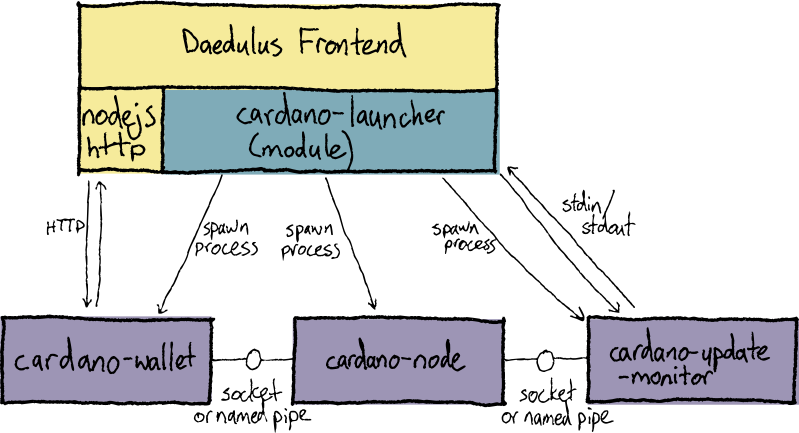
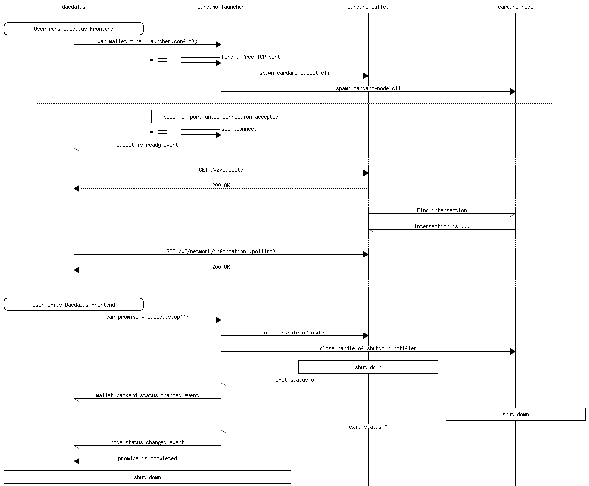

# cardano-launcher Shelley

`cardano-launcher` is a Node.js module for starting
[cardano-wallet](https://github.com/input-output-hk/cardano-wallet)
and the Shelley
[cardano-node](https://github.com/input-output-hk/cardano-node).

Its primary user is
[Daedalus](https://github.com/input-output-hk/daedalus); however it
could be used by any Javascript application.

## Work In Progress

This is a draft of the API for [ADP-92](https://jira.iohk.io/browse/ADP-92).

See the generated docs at https://input-output-hk.github.io/cardano-launcher/modules/_cardanolauncher_.html.

## Component diagram

## Message sequence diagram - launch

## Local Development

### `npm start`

Runs the project in development/watch mode.

### `npm run build`

Bundles the package to the `dist` folder.

### `npm test`

Runs the test watcher ([Jest](https://jestjs.io/docs/en/getting-started))
in an interactive mode.
By default, runs tests related to files changed since the last commit.

Alternatively, to run only unit tests:

    npx tsdx test unit

### `npm run typedoc`

Generates API documentation to the `site` folder.

### `nix-shell`

Runs a bash shell with project development dependencies (e.g. `npm`,
`cardano-wallet`) in the `PATH`.

See [nix.md](https://github.com/input-output-hk/iohk-nix/blob/master/docs/nix.md)
for information on how to set up Nix.

### Updating cardano-wallet versiion

To modify the cardano-wallet version, use [`niv update`](https://github.com/nmattia/niv#update).

    nix-shell --run "niv update cardano-wallet"

To modify the cardano-node version, also use `niv-update`.

    nix-shell --run "niv update cardano-node"

In future, the `cardano-node` version may be defined by
`cardano-wallet`, is it is for `jormungandr`.

## Design docs

 * [`update-system-byron.md`](./docs/update-system-byron.md) -
   Overview of how the update system works in the old codebase (Byron
   era).

 * [`windows-clean-shutdown.md`](./docs/windows-clean-shutdown.md) -
   How to stop the wallet and node processes on Windows.
