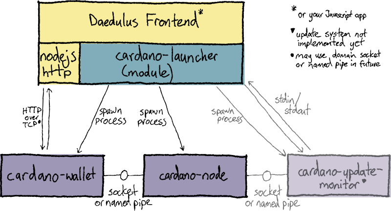

# cardano-launcher Shelley

[](https://buildkite.com/input-output-hk/cardano-launcher) [](https://github.com/input-output-hk/cardano-launcher/actions?query=workflow%3A%22cardano-launcher+Windows+Tests%22+branch%3Amaster)

`cardano-launcher` is a Node.js module for starting
[cardano-wallet](https://github.com/input-output-hk/cardano-wallet)
and the Shelley
[cardano-node](https://github.com/input-output-hk/cardano-node).

Its primary user is
[Daedalus](https://github.com/input-output-hk/daedalus); however it
could be used by any Javascript application. Tagged versions are published to the [npm Registry](https://www.npmjs.com/package/cardano-launcher) as `cardano-launcher`.

## Documentation

See the generated API docs at https://input-output-hk.github.io/cardano-launcher/modules/_cardanolauncher_.html.

See [docs/example.js](./docs/example.js)
and [docs/example-jormungandr.js](./docs/example-jormungandr.js)
for example code.

## Component diagram



## Message sequence diagram - launch


## Local Development

### Build the code

Transpile TypeScript to Javascript in the `dist` directory, checking for errors:

    npm run build

Do the compile as above, but automatically rebuild when a file changes

    npm run build -- --watch

### Run the tests

Runs all tests:

    npm test

To run only `unit` tests matching `idempotent` (for example):

    npm test unit -- -t idempotent

Run the test watcher ([Jest](https://jestjs.io/docs/en/getting-started)) and prompt for usage:

    npm test -- --watch

See the [Jest command-line reference](https://jestjs.io/docs/en/cli) for all the options.

Note that the `cli` tests require the code to already have been built
with `npm run build`.

### Linting and formatting the code

To check linter rules defined in `.eslintrc.json`:

    npm run lint

To automatically fix lint and formatting errors, where possible:

    npm run lint -- --fix

[JavaScript Standard Style](https://standardjs.com/)

### Generate API Documentation

Generates API documentation to the `site` folder.

    npm run typedoc

### Development environment

This runs a bash shell with project development dependencies
(e.g. `npm`, `cardano-wallet`) in the `PATH`.

    nix-shell

See [nix.md](https://github.com/input-output-hk/iohk-nix/blob/master/docs/nix.md)
for information on how to set up Nix.

### Updating cardano-wallet version

To modify the cardano-wallet version, use [`niv update`](https://github.com/nmattia/niv#update).

    nix-shell --run "niv update cardano-wallet -a rev={GIT_TAG}"

or, to use the latest `master` branch revsion:

    nix-shell --run "niv update cardano-wallet --branch master"

The version of `cardano-node` and `jormungandr` are defined by
cardano-wallet because it has specific version requirements for its
backends.

#### Overriding node backend versions

To use your own build of `cardano-node` or `jormungandr`, export your
`PATH` environment variable so that your build is ahead of those set
by the `nix-shell`.

## Design docs

 * [ADP-92](https://jira.iohk.io/browse/ADP-92) - Jira ticket
   containing user stories and task acceptance criteria.

 * [`update-system-byron.md`](./docs/update-system-byron.md) -
   Overview of how the update system works in the old codebase (Byron
   era).

 * [`windows-clean-shutdown.md`](./docs/windows-clean-shutdown.md) -
   How to stop the wallet and node processes on Windows.

 * [`dev.md`](./docs/dev.md) - Development information.

## Demo CLI

This is a very basic executable that lets you test the compiled
library code from your shell.

```shell script
# Build the javascript first.
npm run build

# cardano-node mainnet
./bin/cardano-launcher byron mainnet $BYRON_CONFIGS ./state-launcher

# Jormungandr self-node
./bin/cardano-launcher jormungandr self test/data/jormungandr ./state-launcher
```
